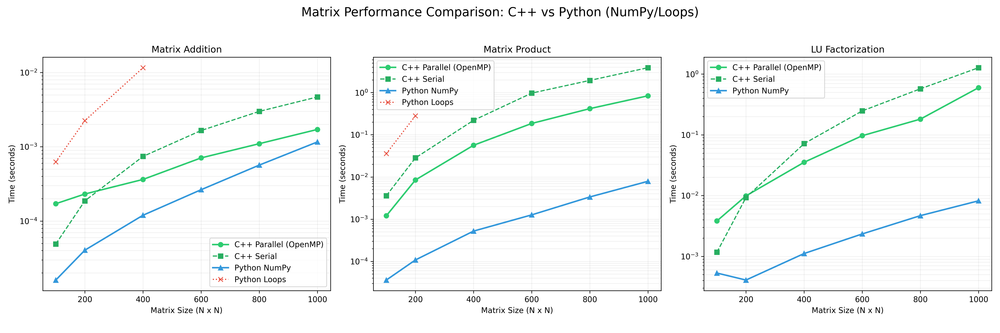

# Matrix Operations: Parallel vs. Serial Benchmarking

This project provides a comprehensive benchmarking suite to compare the performance of matrix operations across different languages (C++ vs. Python) and execution models (Serial vs. Parallel via OpenMP and NumPy).

It is specifically optimized for **macOS (M1/M2/M3 chips)** but works on any system with OpenMP and Python.

## 🚀 Overview

The suite benchmarks the following operations:
- **Matrix Arithmetic**: Addition, Subtraction, Multiplication.
- **Reductions**: Row Sum, Column Sum.
- **Matrix Decomposition**: LU Factorization.

### Performance Hierarchy
1.  **NumPy (Python)**: Usually the fastest due to expertly tuned BLAS/MKL backends.
2.  **C++ Parallel (OpenMP)**: High performance using multi-threading on all CPU cores.
3.  **C++ Serial**: Traditional single-threaded loops.
4.  **Python Loops**: Extremely slow (used for demonstration purposes).

---

## 🛠️ Prerequisites

### 1. C++ Dependencies (macOS)
Apple's default Clang doesn't include OpenMP. You need to install `libomp`:
```bash
brew install libomp cmake
```

### 2. Python Dependencies
Ensure you have Python 3.10+ installed.

---

## 🏗️ Installation & Setup

### 1. Build the C++ Project
```bash
mkdir build && cd build
cmake .. -DOpenMP_ROOT=$(brew --prefix libomp)
make
cd ..
```

### 2. Setup Python Virtual Environment
```bash
python3 -m venv venv
source venv/bin/activate
pip install -r requirements.txt
```

---

## 🏃 Running the Benchmarks

### Option A: The Full Visualizer (Recommended)
This script runs benchmarks for both C++ and Python across multiple matrix sizes (100 to 1000) and generates a comparison graph.
```bash
./venv/bin/python3 performance_visualizer.py
```
*Output: `performance_comparison.png`*

### Option B: Raw C++ Benchmark
Run the standalone C++ benchmark to see Parallel vs. Serial timing in your terminal.
```bash
./build/MatrixOperationsParallel
```

### Option C: Python NumPy vs. Loops
Compare NumPy's speed against raw Python loops.
```bash
./venv/bin/python3 matrix_benchmark.py
```

---

## 📊 Visualizing Results

After running the `performance_visualizer.py`, you will find a `performance_comparison.png` image in the root directory. This provides a logarithmic scale comparison showing how each method scales as the matrix size increases.



## 📊 Benchmark Results (MacBook M3)

Typical results for a **1000 x 1000** matrix on a MacBook M3:

| Operation          | C++ Parallel (s) | C++ Serial (s) | Python NumPy (s) |
|--------------------|------------------|----------------|------------------|
| Matrix Addition    | 0.0029s          | 0.0064s        | 0.0013s          |
| Matrix Product     | 0.8386s          | 3.7754s        | 0.0079s          |
| LU Factorization   | 0.4228s          | 1.2225s        | 0.0207s          |
| Sum of Elements    | 0.0009s          | 0.0033s        | 0.0004s          |

### Key Takeaways:
- **C++ Parallel** provides a **~4.5x speedup** over Serial for Matrix Multiplication.
- **NumPy** is significantly faster (~100x) for Multiplication as it utilizes highly optimized BLAS libraries and hardware-level SIMD instructions that aren't available in standard C++ loops.
- Python logic without NumPy is skipped in large tests due to extreme slowness.

## 📝 Notes on MacBook M3
- The C++ code is configured to use **8 threads** by default to match the M3's performance cores.
- For small matrix sizes (N < 100), the overhead of starting threads might make the serial version faster. The benefits of parallelization become obvious at **N > 400**.
